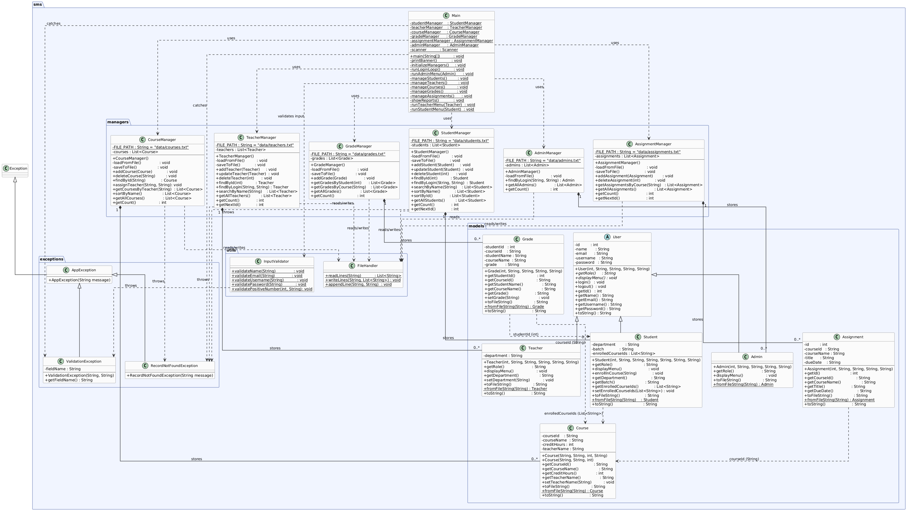

# Learning Management System (LMS)

A console-based Learning Management System built in **Java**, demonstrating core **Object-Oriented Programming** concepts through a practical, real-world application.

---

## Table of Contents

- [Project Overview](#project-overview)
- [Features](#features)
- [OOP Concepts Demonstrated](#oop-concepts-demonstrated)
- [Technologies Used](#technologies-used)
- [Project Structure](#project-structure)
- [UML Class Diagram](#uml-class-diagram)
- [How to Run](#how-to-run)
- [Demo Login Credentials](#demo-login-credentials)
- [Sample Workflow](#sample-workflow)
- [Data File Format](#data-file-format)
- [Future Improvements](#future-improvements)

---

## Project Overview

This system manages the day-to-day operations of an educational institution. It supports three user roles — **Admin**, **Teacher**, and **Student** — each with their own login and dedicated menu. All data is stored in plain `.txt` files using Java's built-in file I/O (`BufferedReader`, `BufferedWriter`) — no external libraries or database required.

---

## Features

| Feature | Description |
|---|---|
| Role-based Login | Admin, Teacher, and Student each see their own menu |
| Student Management | Add, update, delete, search, and sort students |
| Teacher Management | Register teachers, assign courses |
| Course Management | Create courses, assign teachers, sort by name |
| Student Enrollment | Enroll students in specific courses |
| Grade Management | Assign and view grades per student and per course |
| Assignment Management | Create and manage assignments per course |
| Search | Case-insensitive partial name search using Stream API |
| Sorting | Sort students by name or ID using lambda Comparators |
| File Persistence | All data saved to `.txt` files, loaded on startup |
| Input Validation | Centralized validation with custom exceptions |
| System Reports | View total counts of all entities |

---

## OOP Concepts Demonstrated

### 1. Encapsulation
All fields in model classes (`Student`, `Teacher`, `Course`, etc.) are `private`. Access is only through `public` getters and setters.
```java
// User.java
private int    id;
private String name;
private String password;

public String getName()        { return name; }
public void   setName(String n){ this.name = n; }
```

### 2. Inheritance
`Student`, `Teacher`, and `Admin` all extend the abstract `User` class and inherit common fields (`id`, `name`, `email`) and methods (`login()`, `logout()`).
```
User  (abstract)
 ├── Student
 ├── Teacher
 └── Admin
```

### 3. Abstraction
`User` is an **abstract class** — it cannot be instantiated directly. It declares two abstract methods that every subclass **must** implement:
```java
public abstract String getRole();
public abstract void   displayMenu();
```

### 4. Polymorphism
The login system calls `login()` and `displayMenu()` through a `User` reference. The correct subclass method executes at runtime:
```java
User[] users = { admin, teacher, student };
for (User u : users) {
    u.displayMenu(); // calls Admin's, Teacher's, or Student's version automatically
}
```

### 5. Method Overriding
Every subclass overrides `getRole()` and `displayMenu()` with its own implementation:
```java
// Student.java
@Override
public String getRole() { return "STUDENT"; }

// Teacher.java
@Override
public String getRole() { return "TEACHER"; }
```

### 6. Method Overloading
`Course` has two constructors — same name, different parameters:
```java
// With teacher assigned
Course(String id, String name, int credits, String teacherName)

// Without teacher — defaults to "Not Assigned"
Course(String id, String name, int credits)
```

### 7. Custom Exception Handling
A clean exception hierarchy for meaningful, role-specific error messages:
```
AppException  (base)
 ├── ValidationException      — thrown when input fails validation
 └── RecordNotFoundException  — thrown when a record does not exist
```

### 8. File Handling
All data is persisted using standard Java I/O — no external dependencies:
```java
BufferedReader reader = new BufferedReader(new FileReader("data/students.txt"));
BufferedWriter writer = new BufferedWriter(new FileWriter("data/students.txt"));
```

---

## Technologies Used

| Technology | Purpose |
|---|---|
| **Java 17** | Core language |
| **Maven** | Build and run |
| **Java Collections Framework** | `ArrayList`, `List` for in-memory storage |
| **Stream API** | Search and filter operations |
| **Lambda Expressions** | Sorting with `Comparator` |
| **File I/O** | `BufferedReader`, `BufferedWriter` for `.txt` persistence |
| **Custom Exceptions** | `throws`, `try-catch` for structured error handling |
| **Regex** | Input validation via `Pattern.matches` |

---

## Project Structure

```
learning-management-system/
│
├── src/main/java/sms/
│   ├── Main.java                       # Entry point — login system + all menus
│   │
│   ├── models/                         # Entity classes (what things ARE)
│   │   ├── User.java                   # Abstract base class
│   │   ├── Student.java                # Extends User
│   │   ├── Teacher.java                # Extends User
│   │   ├── Admin.java                  # Extends User
│   │   ├── Course.java
│   │   ├── Grade.java
│   │   └── Assignment.java
│   │
│   ├── managers/                       # Business logic (what the app can DO)
│   │   ├── StudentManager.java         # CRUD + search + sort
│   │   ├── TeacherManager.java         # CRUD for teachers
│   │   ├── CourseManager.java          # Course operations
│   │   ├── GradeManager.java           # Grade recording
│   │   ├── AssignmentManager.java      # Assignment management
│   │   └── AdminManager.java           # Admin login
│   │
│   ├── utils/
│   │   ├── FileHandler.java            # Reads and writes .txt files
│   │   └── InputValidator.java         # Input validation with regex
│   │
│   └── exceptions/
│       ├── AppException.java           # Base custom exception
│       ├── ValidationException.java    # For invalid input
│       └── RecordNotFoundException.java # For missing records
│
├── data/                               # Plain text data files (CSV format)
│   ├── students.txt
│   ├── teachers.txt
│   ├── admins.txt
│   ├── courses.txt
│   ├── grades.txt
│   └── assignments.txt
│
├── docs/
│   └── diagram.png                     # UML class diagram
│
├── pom.xml                             # Maven build file
└── README.md
```

---

## UML Class Diagram

This diagram shows the full architecture of the system — including model inheritance, manager aggregations, utility classes, and exception hierarchy.



> The system is built on four OOP pillars: **Abstraction** (`User` abstract class), **Encapsulation** (private fields with getters/setters), **Inheritance** (`Student`, `Teacher`, `Admin` extend `User`), and **Polymorphism** (`getRole()`, `displayMenu()` resolved at runtime). Manager classes own the business logic and delegate all file I/O to `FileHandler`. Custom exceptions (`ValidationException`, `RecordNotFoundException`) extend a common `AppException` base, keeping error handling structured and reusable.

---

## How to Run

### Prerequisites
- Java 17 or higher
- Maven 3.6 or higher

### Steps

**1. Clone the repository:**
```bash
git clone https://github.com/your-username/learning-management-system.git
cd learning-management-system
```

**2. Compile the project:**
```bash
mvn compile
```

**3. Run the application:**
```bash
mvn exec:java
```

The app starts, loads all data from the `data/` folder, and displays the login screen.

---

## Demo Login Credentials

| Role    | Username | Password   |
|---------|----------|------------|
| Admin   | `admin`  | `admin123` |
| Teacher | `emma`   | `teach123` |
| Teacher | `john`   | `teach123` |
| Student | `alice`  | `stud123`  |
| Student | `bob`    | `stud123`  |
| Student | `carol`  | `stud123`  |

---

## Sample Workflow

```
App starts → Loads all .txt files into memory

LOGIN
  Enter username: admin
  Enter password: admin123
  → "Welcome, System Admin! Logged in as ADMIN."

ADMIN MENU
  1. Manage Students
     → Add / Update / Delete / Search / Sort / Enroll in course
  2. Manage Teachers
     → Add teacher / Assign course to teacher
  3. Manage Courses
     → Add course / Sort courses
  4. Manage Grades
     → Assign grade / View by student or course
  5. Manage Assignments
     → Create / Delete assignments
  6. View Reports
     → Total students, teachers, courses, grades, assignments
  0. Logout

Any data change → saved instantly to .txt file
Next login      → data reloaded from file automatically
```

---

## Data File Format

Each entity is stored as one record per line in CSV format:

| File | Format |
|---|---|
| `students.txt` | `id,name,email,username,password,department,batch,courseId1;courseId2` |
| `teachers.txt` | `id,name,email,username,password,department` |
| `admins.txt` | `id,name,email,username,password` |
| `courses.txt` | `courseId,courseName,creditHours,teacherName` |
| `grades.txt` | `studentId,courseId,studentName,courseName,grade` |
| `assignments.txt` | `id,courseId,courseName,title,dueDate` |

---

## Future Improvements

- **Password hashing** — store hashed passwords instead of plain text
- **Database integration** — replace `.txt` files with SQLite or MySQL
- **GUI version** — build a Swing or JavaFX front-end
- **Attendance tracking** — add a dedicated attendance module
- **Student enrollment file** — separate `student_courses.txt` for a clean many-to-many relationship

---

## Author

*3rd Semester Java OOP Project*
